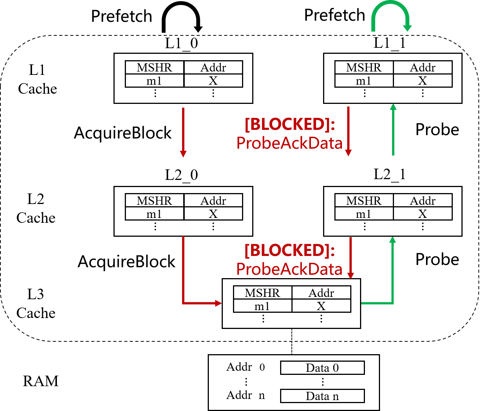
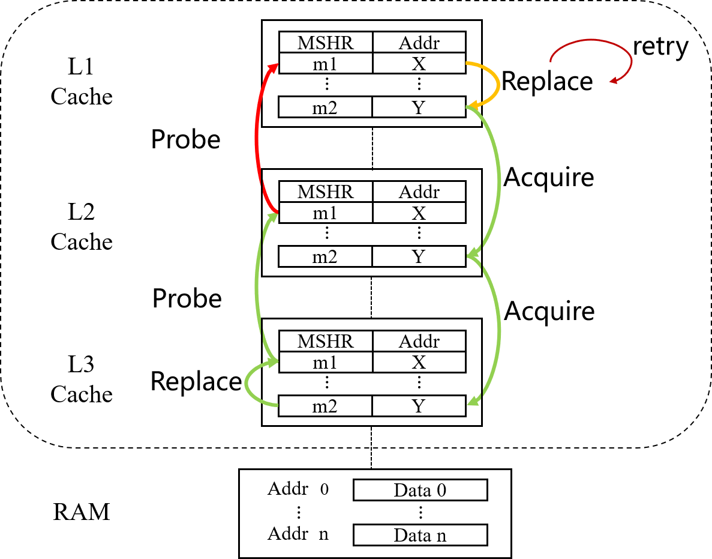
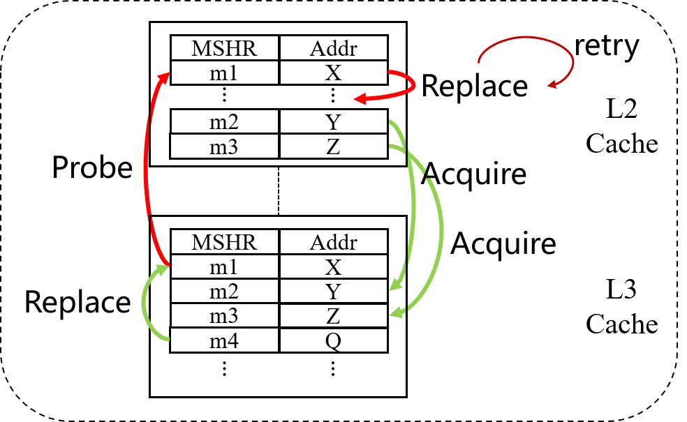
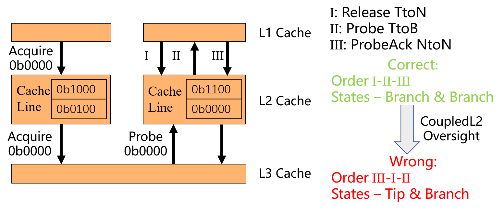

# CoupledL2 Verification

### Files

```shell
├─code
│  ├─HuanCun
│  ├─rocket-chip
│  ├─src
│  │  ├─main
│  │  │  ├─resources
│  │  │  └─scala
│  │  │      ├─chiselFv
│  │  │      ├─coupledL2
│  │  │      └─messageGenarator
│  │  └─test
│  │      └─scala
│  │          └─coupledL2
│  └─utility
├─figures
├─jg-example
└─Waveforms
```

- Chisel codes:

  All the verification codes are in directory `code`, which is based on the open-source [CoupledL2](https://github.com/OpenXiangShan/CoupledL2) on github. 
  
  The enhanced version of ChiselFV is in directory `code/src/main/scala/chiselFv`.
  The TileLink Message Generator is constructed as an L1, in directory `code/src/main/scala/messageGenerator`. 
  The Auxiliary Synchronization Module for the Directory is in `code/src/main/scala/coupledL2/directoryTest.scala`.

  The top-level module of the cache system is `code/src/test/scala/coupledL2/VerifyTop.scala`, which describes how the cache system is constructed and instantiated. All the assertions, parameter settings are written in `VerifyTop` as well.

- JasperGold scripts:

  An example of verification using JasperGold is within directory `jg-example`. It consists of a few Verilog/SystemVerilog codes and an automated script. By running the script in the command line, a .tcl file for running JasperGold will be generated and then JasperGold will be invoked to start verification according to this tcl script.

- Error waveforms:

  The waveforms of the critical errors (described later in this README) are located in directory `waveforms`, recording the scenarios of the counterexamples.

### Environment Configurations

#### Run Verification

The verification environment has been configured to compile or verify CoupledL2 with one click. To compile:

- install Java 8 and Scala 2.13.10

- install [mill](https://github.com/com-lihaoyi/mill) 0.11.1
- run `cd code && make verify`

This will generate the Verilog codes in directory `code/VerilogCodes/L2L3L2`. In order to monitor verification process more conveniently, we suggest replacing `VerifyTop.sv` in the `jg-example` directory and invoking JasperGold in the command line manually.

#### CoupledL2 Versions

The verification environment is based on

[CoupledL2](https://github.com/OpenXiangShan/CoupledL2) branch: master 

​	commit: 514c1ad27c7ab0185a3c07c85146009346b5890d

[rocket-chip](https://github.com/OpenXiangShan/rocket-chip) branch: master

​	commit: 16b7bcb013350e49c9c11d80e17dcff842fccfd6

[Utility](https://github.com/OpenXiangShan/Utility) branch: master

​	commit: 627ced700e866d8c36a6c904347a18368db7565c

### Critical Errors

#### Deadlock Freeness

##### 20240508

- Deadlock Description: 

  Cache $\mathtt{L2_0}$ and $\mathtt{L2_1}$ issue an **Acquire** request for address $0$ at the same time. Cache $\mathtt{L2_1}$ receives the response first. At this time, $\mathtt{L2_0}$ is sending a **Probe** request for address $0$ in cache $\mathtt{L2_1}$, which $\mathtt{L2_1}$ later transfers to $\mathtt{L1_1}$, in order to respond to the **Acquire** request of $\mathtt{L2_0}$. However, $\mathtt{L1_1}$ continues to send **Acquire** requests for address $0$, blocking the entrance of the **Probe** request, which causes a deadlock.



- Bugfix:

  Modify the conditions for blocking a request (in CoupledL2's MainPipe), to ensure the entrance of the Probe request in this situation.

```diff
diff -urN CoupledL2/src/main/scala/coupledL2/MainPipe.scala CoupledL2/src/main/scala/coupledL2/MainPipe.scala
--- CoupledL2/src/main/scala/coupledL2/MainPipe.scala
+++ CoupledL2/src/main/scala/coupledL2/MainPipe.scala
@@ -563,8 +563,8 @@
   io.toReqArb.blockB_s1 :=
     task_s2.valid && bBlock(task_s2.bits) ||
     task_s3.valid && bBlock(task_s3.bits) ||
-    task_s4.valid && bBlock(task_s4.bits, tag = true) ||
-    task_s5.valid && bBlock(task_s5.bits, tag = true)
+    task_s4.valid && bBlock(task_s4.bits, tag = true) && task_s4.bits.opcode(2, 1) === Grant(2, 1) ||
+    task_s5.valid && bBlock(task_s5.bits, tag = true) && task_s5.bits.opcode(2, 1) === Grant(2, 1)
 
   io.toReqArb.blockA_s1 := io.toReqBuf(0) || io.toReqBuf(1)
```

##### 20240531/20240607

- Deadlock Description:

  $\mathtt{X}$ and $\mathtt{Y}$ are two addresses with the same set, processed in L2 and L3 caches. The cache line of $\mathtt{X}$ in L2 needs to replace the cache line corresponding to $\mathtt{Y}$, and L2 is sending an **AcquirePerm** request to L3 for permissions. At the same time, in L3, address $\mathtt{Y}$ needs to replace address $\mathtt{X}$, leading the L3 cache to issue a **Probe** request for $\mathtt{X}$ to L2. The MSHR $\mathtt{m1}$ in L2 will not accept the **Probe** request from L2 until the cache line replacement is complete. The replacement request has been blocked since then, resulting in a deadlock.	



- Bugfix:

  Fix the replacement algorithm, so that CoupledL2 can choose another way when the replacement is blocked for multiple times.

  refer to CoupledL2's issues #XXX

##### 20240621

- Deadlock Description:

  This is an extended version of the above deadlock **20240531/20240607**. There are too many addresses with the same set at the above situation, and they occupied every way of the L2 cache. At the same time, there is a cache line replacement. For the MSHRs in the L2 cache, no **Probe** request will be accepted until the cache line replacement is complete. However, address $\mathtt{X}$ can not complete the replacement no matter what, causing a deadlock.



- Bugfix:

  Limit the parallelism of the L2 cache, so that there are less requests whose addresses have the same set.

  refer to CoupledL2's issues #XXX

#### Mutual Exclusion

- Error Description:

  Address $0$ had cache line states in two L2 caches that exhibited a combination of **Tip**-**Branch**, violating the TileLink protocol. From the main pipe's point, transaction I, II and III should process sequentially, while in the pipeline, the order is actually transaction III, I, II. This violation is due to an oversight in the implementation of CoupledL2. According to the TlieLink protocol, L1 should issue the **Probe** request after it receives the **ReleaseAck** response, and CoupledL2 did not implement this detail, which in turn triggers the mutual exclusion property assertion.



- Bugfix:

  Fix the condition of sending **Probe** requests, so as to ensure that it happens after the **ReleaseAck** response.

  refer to CoupledL2's issues #XXX
