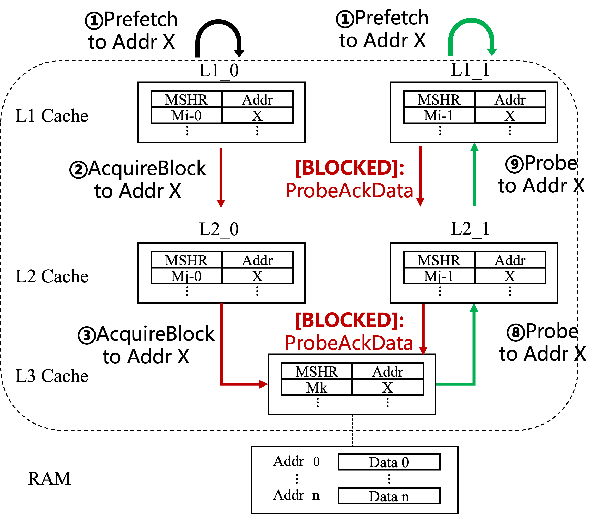
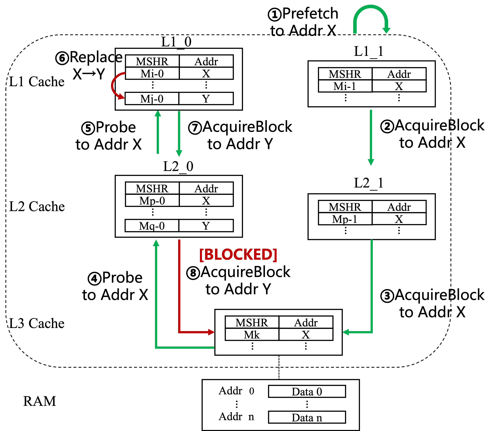
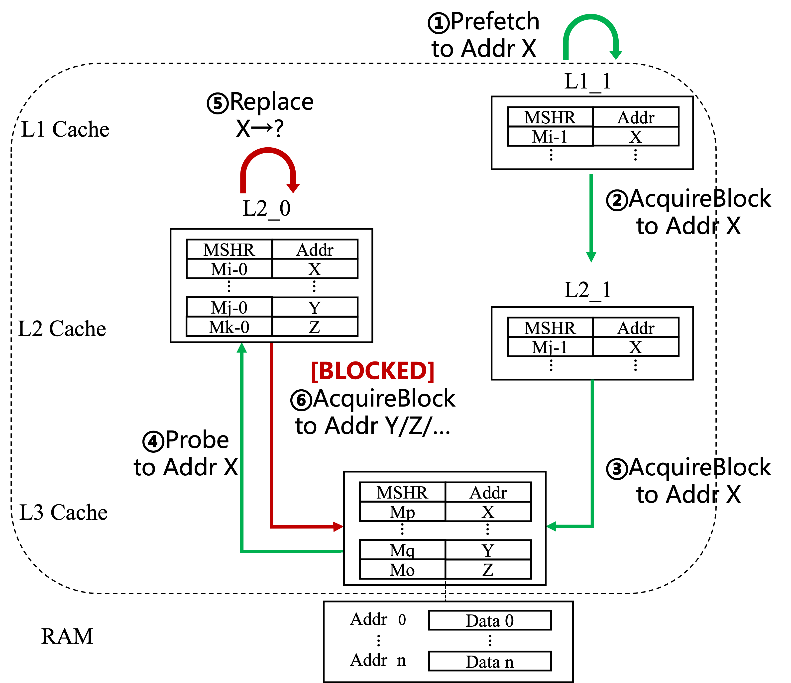
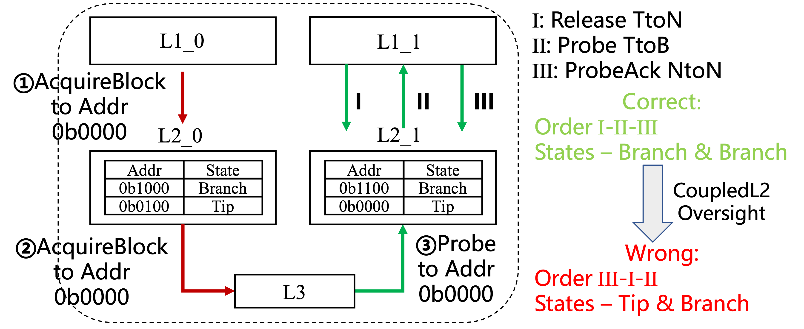
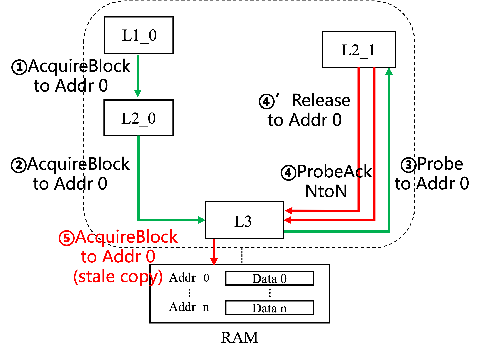

# CoupledL2 Verification

### Files

```shell
.
├── code
│   ├── pylibfst-cache
│   │   ├── cache
│   │   │   ├── ...
│   │   │   ├── tllog_parser.py
│   │   │   ├── tllog_visual.py
│   │   │   └── deadlock_parser.py
│   │   └── README.md
│   ├── RocketChip-InclusiveCache
│   │   ├── generators
│   │   │   ├── ...
│   │   │   ├── rocket-chip
│   │   │   ├── rocket-chip-inclusive-cache
│   │   │   └── MessageGenerator
│   │   └── inclusivecache-verification
│   │       ├── Makefile
│   │       ├── README.md
│   │       └── src
│   └── XiangShan-CoupledL2
│       ├── ...
│       ├── coupledL2
│       │   ├── ...
│       │   ├── rocket-chip
│       │   ├── HuanCun
│       │   ├── src
│       │   └── utility
│       └── src
├── figures
├── jg-example
├── README.md
└── waveforms
```

- Chisel codes:

  All the verification codes are in directory `code` and implements the two case studies. Two verification harnesses are provided:
  
  1. XiangShan-CoupledL2: L1 = MessageGenerator, L2 = CoupledL2, L3 = HuanCun, RAM = TLRAM (under `code/XiangShan-CoupledL2`).
  2. RocketChip-InclusiveCache (Chipyard based): L1 = MessageGenerator, L2 = InclusiveCache, RAM = TLRAM (under `code/RocketChip-InclusiveCache`).

  Mechanism I (TileLink Message Generator):
  - XiangShan: `code/XiangShan-CoupledL2/src/main/scala/messageGenerator`
  - InclusiveCache: `code/RocketChip-InclusiveCache/generators/MessageGenerator`

  Mechanism II (Parameter Reduction & formal configuration):
  - XiangShan top / parameters & assertions: `code/XiangShan-CoupledL2/src/test/scala/coupledL2Verification/VerifyTop.scala`
  - InclusiveCache top / parameters & assertions: `code/RocketChip-InclusiveCache/inclusivecache-verification/src/test/scala/TestTop.scala`

  Mechanism III (Auxiliary Synchronization Modules):
  - Directory mirror: `code/XiangShan-CoupledL2/coupledL2/src/main/scala/coupledL2/DirectoryTest.scala`
  - Data storage mirror: `code/XiangShan-CoupledL2/coupledL2/src/main/scala/coupledL2/DataStorageTest.scala`
  These run in lock-step with `Directory` and `DataStorage` to provide multi-read visibility without altering functional memories.

  Enhanced ChiselFV (bounded liveness, unified engine invocation):
  - XiangShan implementation: `code/XiangShan-CoupledL2/src/main/scala/chiselFv`
  - InclusiveCache implementation: `code/RocketChip-InclusiveCache/inclusivecache-verification/src/main/scala/chiselFv`

  Deadlock debugging methodology:
  - Scripts: `code/pylibfst-cache/cache` (`deadlock_parser.py`, `tllog_parser.py`, `tllog_visual.py`).

  Property assertions:
  - XiangShan-CoupledL2 (`code/XiangShan-CoupledL2/src/test/scala/coupledL2Verification/VerifyTop.scala`):
    - Deadlock freeness: bounded liveness over per-MSHR timers via `astRelaxedLiveness`/`fvAssert`.
    - TileLink state coherence: mutual-exclusion across L2–L2 and L1–L2 illegal state pairs using bored directory/tag arrays.
    - Inclusivity: if a line is valid in L1, L2 must hold the line or an in-flight MSHR must cover it (timer-guarded assumption + `fvAssert`).
    - Data consistency: forbid conflicting accesses on the same address; shared BRANCH replicas must agree on data or be covered by in-flight MSHRs.
  - RocketChip-InclusiveCache (`code/RocketChip-InclusiveCache/inclusivecache-verification/src/test/scala/TestTop.scala`):
    - Deadlock freeness: per-MSHR `request_valid` → `allocate.valid || !request_valid` bounded progress using `astRelaxedLiveness(..., 1000)`.

- JasperGold scripts:

  An example of verification using JasperGold is within directory `jg-example`. It consists of a few Verilog/SystemVerilog codes and an automated script. By running the script in the command line, a .tcl file for running JasperGold will be generated and then JasperGold will be invoked to start verification according to this tcl script.

- Error waveforms:

  The waveforms of the critical errors (described later in this README) are located in directory `waveforms`, recording the scenarios of the counterexamples.

### Environment Configurations

#### Run Verification

##### XiangShan-CoupledL2

The verification environment has been configured to compile or verify CoupledL2 with one click. To compile:

- install Java 8 and Scala 2.13.10
- install [mill](https://github.com/com-lihaoyi/mill) 0.11.1
- run `cd code/XiangShan-CoupledL2 && make verify`

This will generate the Verilog code `VerifyTop.sv` in directory `code/XiangShan-CoupledL2/Verilog`. In order to monitor verification process more conveniently, we suggest replacing `VerifyTop.sv` in the `jg-example` directory and invoking JasperGold in the command line manually.

##### RocketChip-InclusiveCache

Unlike CoupledL2, this project uses sbt to compile:

- install Java 8 and Scala 2.13.10
- install [sbt](https://www.scala-sbt.org)
- run `cd code/RocketChip-InclusiveCache && make -C inclusive-verification verilog`

This will generate the Verilog code `TestTop.sv` in directory `code/RocketChip-InclusiveCache/inclusivecache-verification/build`. In order to monitor verification process more conveniently, we suggest replacing `TestTop.sv` in the `jg-example` directory and invoking JasperGold in the command line manually.

#### CoupledL2 Versions

The verification environment is based on

[CoupledL2](https://github.com/OpenXiangShan/CoupledL2) branch: master 

​	commit: 514c1ad27c7ab0185a3c07c85146009346b5890d

#### InclusiveCache Versions

The verification environment is based on

[chipyard](https://github.com/ucb-bar/chipyard.git) branch: main 

​	commit: 973f8732d4ffeb8cc231edf109e84eef114e3d6e

### Critical Errors
Below we summarize representative counterexamples produced by the automated model checking flow. Each corresponds to a violation.

#### Deadlock Freeness

##### 0508



Timeline (prefetch requests to the same address induce Probe starvation):

- ① External stimulus issues simultaneous prefetch-style requests for address 0 to $\mathtt{L1_0}$ and $\mathtt{L1_1}$.
- ② Both $\mathtt{L1}$ instances miss; each sends an **AcquireBlock** for address 0 to its attached $\mathtt{L2}$ ($\mathtt{L2_0}$ / $\mathtt{L2_1}$).
- ③ Both $\mathtt{L2}$ miss and forward **AcquireBlock** for address 0 to $\mathtt{L3}$ (HuanCun).
- ④ $\mathtt{L3}$ services $\mathtt{L2_1}$ first (no copy resident); fetches from memory and returns **GrantData** to $\mathtt{L2_1}$. 
- ⑤ $\mathtt{L2_1}$ responds with **GrantAck** to $\mathtt{L3}$. 
- ⑥ $\mathtt{L2_1}$ installs the line (state None→Trunk) and sends **GrantData** downstream to $\mathtt{L1_1}$. 
- ⑦ $\mathtt{L1_1}$ returns **GrantAck**.
- ⑧ $\mathtt{L3}$ begins servicing $\mathtt{L2_0}$'s miss; because $\mathtt{L1_1}/\mathtt{L2_1}$ already hold the line it issues **Probe** to $\mathtt{L2_1}$.
- ⑨ $\mathtt{L2_1}$ forwards **Probe** to $\mathtt{L1_1}$.

Root cause: Continuous prefetch requests keep $\mathtt{L1_1}$ pipeline occupied with the same set+tag, making `blockB_s1` permanently high. The B-channel (**Probe**) request cannot enter MainPipe; $\mathtt{L2_1}$ and $\mathtt{L3}$ wait indefinitely for **ProbeAckData**, forming a circular wait on pipeline resources.

Fix: Refine MainPipe B-channel blocking conditions so that only specific in-flight Grant-related pipeline stages block B-channel admission, allowing Probe to make forward progress.

```diff
diff -urN verify-l2/src/main/scala/coupledL2/MainPipe.scala CoupledL2/src/main/scala/coupledL2/MainPipe.scala
--- verify-l2/src/main/scala/coupledL2/MainPipe.scala
+++ CoupledL2/src/main/scala/coupledL2/MainPipe.scala
@@ -563,8 +563,8 @@
   io.toReqArb.blockB_s1 :=
     task_s2.valid && bBlock(task_s2.bits) ||
     task_s3.valid && bBlock(task_s3.bits) ||
-    task_s4.valid && bBlock(task_s4.bits, tag = true) ||
-    task_s5.valid && bBlock(task_s5.bits, tag = true)
+    task_s4.valid && bBlock(task_s4.bits, tag = true) && task_s4.bits.opcode(2, 1) === Grant(2, 1) ||
+    task_s5.valid && bBlock(task_s5.bits, tag = true) && task_s5.bits.opcode(2, 1) === Grant(2, 1)
 
   io.toReqArb.blockA_s1 := io.toReqBuf(0) || io.toReqBuf(1)
```

##### 0531/0607



Timeline (mutual replacement pressure + set serialization in $\mathtt{L3}$):

- ① External stimulus sends prefetch for address 0 to $\mathtt{L1_1}$.
- ② $\mathtt{L1_1}$ miss → **AcquireBlock** to $\mathtt{L2_1}$.
- ③ $\mathtt{L2_1}$ miss → **AcquireBlock** to $\mathtt{L3}$.
- ④ $\mathtt{L3}$ processes $\mathtt{L2_1}$; copies already reside in $\mathtt{L1_0}/\mathtt{L2_0}$ → issues **Probe** for address 0 to $\mathtt{L2_0}$.
- ⑤ $\mathtt{L2_0}$ forwards **Probe** to $\mathtt{L1_0}$.
- ⑥ $\mathtt{L1_0}$ must evict (its way holding address 0 now occupied by address 4) → replacement required.
- ⑦ Concurrently $\mathtt{L1_0}$ issues **AcquireBlock** for address 4 to $\mathtt{L2_0}$.
- ⑧ $\mathtt{L2_0}$ miss on address 4 → **AcquireBlock** to $\mathtt{L3}$.

Root cause: HuanCun ($\mathtt{L3}$) enforces per-set serialization: Probe for set S (address 0) blocks subsequent Acquire for another line with same set (address 4). The evicting $\mathtt{L1_0}$ cannot complete replacement (needs Acquire completion) while $\mathtt{L3}$ cannot advance the Acquire until the Probe sequence finishes. Circular dependency forms across replacement, Probe, and serialized set arbitration.

Fix: Adjust CoupledL2 replacement algorithm to select an alternative way after repeated block events, breaking the cycle. 
(Refer to CoupledL2 on Github: issues #80–#83, #88, #94, #95, #99, #100, master branch commit b485c6b7e6049fffed5104a5e8a29b29c33e6547; kunminghu branch commit f286ffa127583eb4d52cfd856f9ce6d87d00ec82)

##### 0621



Extended scenario: high contention—all ways of $\mathtt{L2_0}$ filled by lines mapping to the same set; any new request triggers replacement while multiple in-flight operations target identical set.

- ① Prefetch for address 0 to $\mathtt{L1_1}$.
- ② $\mathtt{L1_1}$ miss → **AcquireBlock** to $\mathtt{L2_1}$.
- ③ $\mathtt{L2_1}$ miss → **AcquireBlock** to $\mathtt{L3}$.
- ④ $\mathtt{L3}$ sees residency in $\mathtt{L1_0}/\mathtt{L2_0}$ → **Probe** to $\mathtt{L2_0}$.
- ⑤ $\mathtt{L2_0}$ needs replacement (target way occupied by other same-set addresses).
- ⑥ All ways of $\mathtt{L2_0}$ busy; parallel AcquireBlock requests for the same set already outstanding to $\mathtt{L3}$.

Root cause: Per-set serialization in $\mathtt{L3}$ + saturation of ways prevents completion of replacement needed to respond to Probe; Probe completion prerequisite (replacement write-back) waits on Acquire responses that are themselves stalled behind the Probe sequence.

Fix: Limit L1 parallelism (reduce simultaneous same-set request issuance) to mitigate way saturation and unblock Probe progress. 
(Refer to CoupledL2 on Github: issues #127, #143)

#### TileLink State Coherence

##### 0712



Violation: Simultaneous illegal copy-state combination (**Tip**–**Branch**) for the same address across two $\mathtt{L2}$ caches, contravening TileLink coherence rules (ReleaseAck must precede accepting a Probe on the same line).

Initial state:
- $\mathtt{L2_0}$: holds 0b1000 (Branch), 0b0100 (Tip)
- $\mathtt{L2_1}$: holds 0b1100 (Branch), 0b0000 (Tip)

Timeline:
- ① External stimulus issues request for 0b0000 to $\mathtt{L1_0}$.
- ② Miss → **Acquire** from $\mathtt{L1_0}/\mathtt{L2_0}$ to $\mathtt{L3}$.
- ③ $\mathtt{L3}$ detects residency in $\mathtt{L1_1}/\mathtt{L2_1}$ → sends **Probe** to both.
- ④ $\mathtt{L1_1}$ emits **Release TtoN**, awaiting **ReleaseAck**.
- ⑤ $\mathtt{L2_1}$ SinkB accepts **Probe TtoB** for same address before **ReleaseAck** is returned.
- ⑥ **ProbeAck** processed ahead of pending Release; $\mathtt{L2_1}$ temporarily retains ownership marking.
- ⑦ $\mathtt{L3}$ completes **AcquireBlock** and sends **GrantData** to $\mathtt{L2_0}$ while $\mathtt{L2_1}$ still lacks **ReleaseAck**.

Root cause: Early Probe acceptance prior to Release transaction completion breaks required ordering (Release → ReleaseAck → Probe), enabling transient dual privileged states.

Fix: Split `replaceConflict` into conditions that block upon either active refill or missing ReleaseAck, preventing premature Probe intake:
```scala
val replaceConflictMask = VecInit(io.msInfo.map(s =>
  s.valid && s.bits.set === task.set && s.bits.metaTag === task.tag &&
    (s.bits.blockRefill || !s.bits.w_releaseack)
)).asUInt
```
After adjustment, SinkB suppresses tasks while a related Release is incomplete, enforcing the protocol sequence.
(Refer to CoupledL2 on Github: issues #208)

#### Data Consistency

##### 1017



Violation: Data returned by **Grant** diverges from the most recent **ReleaseData** value for the same cache line under concurrent Acquire/Release, breaching the data consistency invariant.

Mechanism (non-inclusive cMSHR scheduling in HuanCun): when concurrent Acquire and Release target the same address:
- If they choose the same way: Release writes line to $\mathtt{L3}$; Acquire can read updated data directly.
- If they choose different ways: Release writes to memory; Acquire later reads from memory.

Timeline:
- ① $\mathtt{L1_1}$ via $\mathtt{L2_1}$ issues **AcquireBlock** for address 0 (miss), occupying an `a_mshr` → request to $\mathtt{L3}$.
- ② $\mathtt{L3}$ sends **Probe** to $\mathtt{L2_0}$; $\mathtt{L2_0}$ responds **ProbeAck NtoN** (no data).
- ③ Nearly simultaneously $\mathtt{L2_0}$ initiates **ReleaseData** (replacement) entering a `c_mshr` for same set, selecting a way colliding with pending Acquire.
- ④ Before Release commits data to $\mathtt{L3}$, Acquire reads memory (stale copy).
- ⑤ Memory still holds old value; resulting **Grant** `d.data` mismatches intended updated Release data.

Root cause: Way selection & non-inclusive cMSHR ordering permits memory read to precede completion of Release write-back, exposing stale data.

Fix direction: Ensure ordering between Release write completion and subsequent Grant data sourcing for identical lines (e.g., enforce serialization or merge of colliding way selections) – implementation tracked separately.
