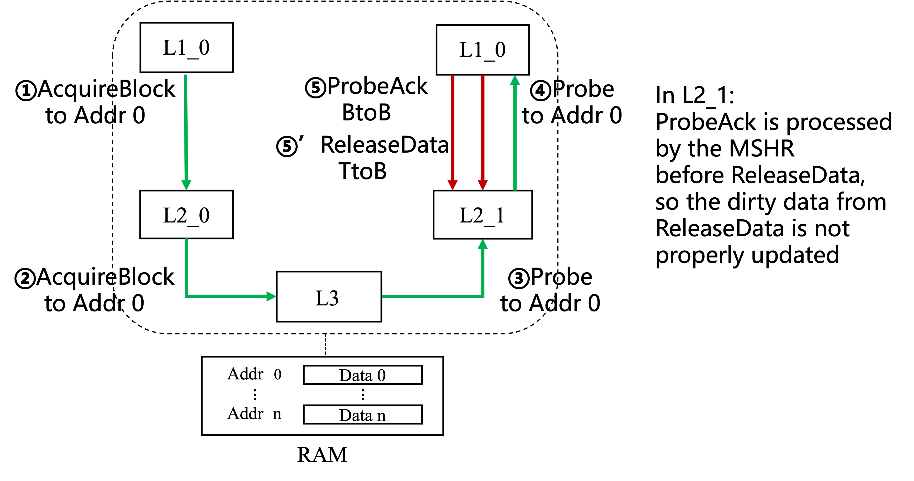

# CoupledL2 Verification

> Artifacts for the paper:
> **Protocol-Independent Bug-Hunting for Industrial Non-Blocking Cache Hierarchies in an Agile Chisel Framework**

---

## Results

This repository corresponds to the paper's counterexample-first bug-hunting workflow and keeps the case-study artifacts in a directly reproducible layout.

### Reported Highlights

1. On XiangShan CoupledL2, the campaign triggers 12 actionable counterexamples under the configured budget.
2. Triggered failures span progress stall/deadlock, data consistency, and protocol-state legality categories.
3. The same workflow is transferred to RocketChip InclusiveCache with mechanical adaptation at the harness/property integration layer.

The repository datasets (cause notes, traces, waveforms, and assertion locations) are structured to support replay, diagnosis, and fix validation across the two case studies.

**Contents**

- [CoupledL2 Verification](#coupledl2-verification)
  - [Results](#results)
    - [Reported Highlights](#reported-highlights)
  - [Overview](#overview)
    - [Current Snapshot Organization](#current-snapshot-organization)
  - [Repository Structure](#repository-structure)
  - [Requirements](#requirements)
    - [Recommended Toolchain](#recommended-toolchain)
    - [TL-Test Toolchain Additions](#tl-test-toolchain-additions)
    - [Root Makefile Checks](#root-makefile-checks)
  - [Quick Start](#quick-start)
    - [Index Mapping](#index-mapping)
    - [Common Commands](#common-commands)
    - [Ablation Commands](#ablation-commands)
  - [Ablation Study Mapping](#ablation-study-mapping)
    - [Paper-to-Code Correspondence](#paper-to-code-correspondence)
  - [Experimental Parameter Reduction](#experimental-parameter-reduction)
    - [Paper Parameter Reduction Table](#paper-parameter-reduction-table)
    - [Code Location Mapping](#code-location-mapping)
  - [Dataset](#dataset)
    - [Critical Errors](#critical-errors)
      - [Probe-Blocking Deadlock](#probe-blocking-deadlock)
      - [Same-Set Replacement/Probe Deadlock](#same-set-replacementprobe-deadlock)
      - [High Same-Set Contention Deadlock](#high-same-set-contention-deadlock)
      - [Peer-L2 Tip/Branch Legality Violation](#peer-l2-tipbranch-legality-violation)
      - [Stale Read After Concurrent Acquire/Release](#stale-read-after-concurrent-acquirerelease)
      - [Nested Writeback Data Merge Race](#nested-writeback-data-merge-race)
      - [Bounded-Latency Progress Mismatch](#bounded-latency-progress-mismatch)

---

## Overview

This repository contains two case studies:

1. XiangShan CoupledL2-based hierarchy.
2. RocketChip InclusiveCache-based hierarchy.

| Item | Description |
| --- | --- |
| Workflow Stage 1 | Bug-hunting-ready DUV construction |
| Workflow Stage 2 | Counterexample-first model checking |
| Property Categories | Progress stall/deadlock freeness, data consistency, inclusion-policy conformance, protocol-state legality |

### Current Snapshot Organization

1. Deadlock-focused cases are organized as deadlock-v0 to deadlock-v4.
2. Consistency-focused cases are organized as copy_equality and write_read.
3. Protocol-state-legality-focused case is organized as peer-l2.
4. Inclusion-policy conformance is covered in properties but does not have a standalone case directory in this snapshot.

---

## Repository Structure

```text
.
|- code
|  |- CaseStudy_1
|  |  |- XiangShan-CoupledL2-copy_equality
|  |  |- XiangShan-CoupledL2-write_read
|  |  |- XiangShan-CoupledL2-peer-l2
|  |  |- XiangShan-CoupledL2-Native-L1
|  |  |- XiangShan-CoupledL2-TL-Test
|  |  |- XiangShan-CoupledL2-deadlock-v0
|  |  |- XiangShan-CoupledL2-deadlock-v1
|  |  |- XiangShan-CoupledL2-deadlock-v2
|  |  |- XiangShan-CoupledL2-deadlock-v3
|  |  `- XiangShan-CoupledL2-deadlock-v4
|  |- CaseStudy_2
|  |  `- RocketChip-InclusiveCache
|  |     |- Chisel
|  |     |- Verilog
|  |     `- inclusivecache-verification
|  `- preprocess_sva.py
|- figures
|  |- deadlock-1.png
|  |- deadlock-2.png
|  |- deadlock-3.png
|  |- TileLink_state_coherence.png
|  |- consistency.png
|  |- mutual.png
|  |- mutual-2.png
|  |- mutual-3.png
|  |- mutual_waveform.png
|  `- waveform_deadlock.png
|- Makefile
`- README.md
```

Notes:
Each XiangShan version directory is self-contained with Chisel, Verilog, and an FST trace.

---

## Requirements

### Recommended Toolchain

| Tool | Version | Purpose |
| --- | --- | --- |
| Java | 8 | Build/runtime dependency |
| Scala | 2.13.x | Chisel/verification codebase |
| mill | 0.11.1 | XiangShan variant builds |
| sbt | latest stable | InclusiveCache build flow |
| Python | 3.x | Root scripts, preprocessing, and staging utilities |
| JasperGold (jg) | installed and in PATH | Formal runs |

### TL-Test Toolchain Additions

The TL-Test ablation (`code/CaseStudy_1/XiangShan-CoupledL2-TL-Test`) needs a larger toolchain than the formal-only flow:

| Tool | Purpose |
| --- | --- |
| python / python3 | TL-Test helper scripts and staged verification harness processing |
| mill | Build the CoupledL2-side DUT used by TL-Test |
| cmake | Configure the TL-Test host build |
| verilator | Build the Verilator-host executable |
| C++17 compiler (`g++` or `clang++`) | Compile the TL-Test host and generated Verilator code |
| sqlite3 development library | Linked by the TL-Test host build (`-lsqlite3`) |

The root `make tltest ...` entry checks for `python`, `mill`, `verilator`, and `cmake`. If your Verilator install lives in a non-default location, TL-Test also supports `VERILATOR_INCLUDE`, `CXX_COMPILER`, and `SQLITE3_ROOT`; see `code/CaseStudy_1/XiangShan-CoupledL2-TL-Test/Makefile`.

### Root Makefile Checks

1. Compile stage: java and python are required.
2. XiangShan variants (index 0-7): mill required before compile.
3. InclusiveCache (index 8): sbt required before compile.
4. Verification stage (`setup.sh`): jg required before formal run.
5. TL-Test ablation (`make tltest ...`): python, mill, verilator, cmake required before build.
6. Native-L1 ablation (`make native-l1`): java, python, mill, jg required.

---

## Quick Start

The root Makefile provides one-click dispatch:

```bash
make help
make verify <index>
```

### Index Mapping

| Index | Case Directory |
| ---: | --- |
| 0 | XiangShan-CoupledL2-copy_equality |
| 1 | XiangShan-CoupledL2-write_read |
| 2 | XiangShan-CoupledL2-deadlock-v0 |
| 3 | XiangShan-CoupledL2-deadlock-v1 |
| 4 | XiangShan-CoupledL2-deadlock-v2 |
| 5 | XiangShan-CoupledL2-deadlock-v3 |
| 6 | XiangShan-CoupledL2-deadlock-v4 |
| 7 | XiangShan-CoupledL2-peer-l2 |
| 8 | RocketChip-InclusiveCache |

### Common Commands

Run one XiangShan case:

```bash
make verify 0
```

Run InclusiveCache case:

```bash
make verify 8
```

Direct local flow example:

```bash
cd code/CaseStudy_1/XiangShan-CoupledL2-write_read/Chisel
make auto
cd ../Verilog
./setup.sh VerifyTop*.sv
```

Override verification mode example:

```bash
make verify 1 VERIFY_MODE=large
```

### Ablation Commands

The paper compares the full workflow against several ablation variants. The root `Makefile` exposes the runnable ones directly:

```bash
# baseline simulation ablation (TL-Test)
make tltest 2

# w/o parameter reduction
make verify 1 VERIFY_MODE=large

# w/o bounded liveness as safety primitive
make verify 2 VERIFY_ABLATION=wo-bounded-liveness

# w/o Simplified L1
make native-l1
```

For the Native-L1 flow, the default verified top is `../Chisel/VerifyTop_all.sv`. You can override it if needed:

```bash
make native-l1 NATIVE_L1_TOP=../Chisel/VerifyTop_all.sv
```

---

## Ablation Study Mapping

Section 6 of `main.tex` evaluates the full XiangShan workflow against five comparison configurations. The repository mapping is:

### Paper-to-Code Correspondence

| Paper configuration | Repository support | How to run / inspect | Notes |
| --- | --- | --- | --- |
| `our workflow` | Main XiangShan cases under `code/CaseStudy_1/XiangShan-CoupledL2-*` | `make verify <index>` | Uses Simplified L1, reduced parameters, synchronization modules, and bounded liveness checks. |
| `baseline (TL-Test)` | `code/CaseStudy_1/XiangShan-CoupledL2-TL-Test` | `make tltest <case-or-index>` | Simulation-only comparison under the same case selection. |
| `w/o parameter reduction` | Same XiangShan case directories | `make verify <index> VERIFY_MODE=large` | `VERIFY_MODE=large` switches from the reduced verification profile back to the development-scale parameter setting described in the paper. |
| `w/o bounded liveness as safety primitive` | Deadlock cases plus `code/preprocess_sva.py` | `make verify <deadlock-index> VERIFY_ABLATION=wo-bounded-liveness` | `preprocess_sva.py` rewrites generated bounded timer assertions into unbounded SVA eventuality checks for this ablation. |
| `w/o Simplified L1` | `code/CaseStudy_1/XiangShan-CoupledL2-Native-L1` | `make native-l1` | Replaces the paper's Simplified L1 boundary model with a `NativeL1` package derived from XiangShan's original L1-side behavior. |
| `w/o synchronization modules` | No standalone runnable target in this snapshot | Text-only description | This removal disables the auxiliary synchronized observation mirrors, so state/data-aware checks become uncheckable even though progress checks still conceptually remain. |

About the code layout for these ablations:

1. `code/CaseStudy_1/XiangShan-CoupledL2-TL-Test` is the simulation baseline used for the TL-Test comparison in `main.tex`.
2. `VERIFY_MODE=small|large` is the switch used to move between the reduced formal profile and the development-value profile for the parameter-reduction ablation.
3. `code/preprocess_sva.py` implements the bounded-liveness removal by post-processing generated Verilog assertions in the deadlock cases.
4. `code/CaseStudy_1/XiangShan-CoupledL2-Native-L1` contains the Native-L1 harness used for the `w/o Simplified L1` comparison.
5. The `w/o Sync Modules` row is documented for correspondence with the paper, but no separate runnable artifact is provided here because the removal intentionally breaks the observability support needed by the relevant properties.

---

## Experimental Parameter Reduction

### Paper Parameter Reduction Table

The full development-vs-verification parameter values used in the paper are recorded in `tables/parameters.tex`.

| Parameter | Cache Component | Development Value | Verification Value |
| --- | --- | ---: | ---: |
| ways | L2 Cache | 8 | 2 |
| ways | L3 Cache | 16 | 2 |
| sets | L2 Cache | 512 | 4 |
| sets | L3 Cache | 4096 | 4 |
| banks | L2/L3 Cache | 4 | 1 |
| blockBytes | L2/L3 Cache | 64 | 2 |
| busWidth | L2/L3 Cache | 256 | 8 |
| mshrs | L2 Cache | 16 | 4 |
| mshrs | L3 Cache | 16 | 6 |
| address | L1/L2/L3/RAM | 24 bits | 5 bits |

### Code Location Mapping

The repository code stores these reductions as harness-level knobs (`if (useLarge) ... else ...`) and explicit bank/address settings in each XiangShan case. Representative locations are listed below.

| Parameter | Representative code location(s) | How it is encoded |
| --- | --- | --- |
| ways / sets / blockBytes / mshrs (L2/L3) | `code/CaseStudy_1/XiangShan-CoupledL2-write_read/Chisel/src/test/scala/coupledL2Verification/VerifyTop.scala` | `L2Param(...)` and `HCCacheParameters(...)` use `if (useLarge) ... else ...`, where the `else` branch is the reduced verification profile. |
| ways / sets / blockBytes | `code/CaseStudy_1/XiangShan-CoupledL2-write_read/Chisel/src/test/scala/coupledL2Verification/VerifyTop.scala` | `MessageGeneratorParam(...)` uses `if (useLarge) ... else ...` to reduce request-space complexity for formal runs. |
| banks | `code/CaseStudy_1/XiangShan-CoupledL2-write_read/Chisel/src/test/scala/coupledL2Verification/VerifyTop.scala` and `code/CaseStudy_1/XiangShan-CoupledL2-copy_equality/Chisel/src/test/scala/coupledL2Verification/VerifyTop.scala` | `case huancun.BankBitsKey => 0` enforces a single-bank setting for verification. |
| busWidth | `code/CaseStudy_1/XiangShan-CoupledL2-write_read/Chisel/src/test/scala/coupledL2Verification/VerifyTop.scala`, `code/CaseStudy_1/XiangShan-CoupledL2-write_read/Chisel/src/main/scala/coupledL2/tl2tl/TL2TLCoupledL2.scala` | Reduced bus width is reflected via `TLChannelBeatBytes(if (useLarge) 32 else 1)` and `beatBytes = (if env VERIFY_MODE=large then 32 else 1)`. |
| address bits | `code/CaseStudy_1/XiangShan-CoupledL2-write_read/Chisel/src/test/scala/coupledL2Verification/VerifyTop.scala` | `TLRAM(AddressSet(0, if (useLarge) 0xffffffL else 0x1fL), ...)` corresponds to 24-bit vs 5-bit address space. |
| size mode switch | `code/CaseStudy_1/XiangShan-CoupledL2-write_read/Chisel/src/test/scala/coupledL2Verification/VerifyTop.scala`, `code/CaseStudy_1/XiangShan-CoupledL2-write_read/Chisel/src/test/scala/coupledL2Verification/AutoVerify.scala` | `VERIFY_MODE` selects small/large. |

---

## Dataset

### Critical Errors

This section records the root-cause explanations for the critical XiangShan CoupledL2 counterexamples.

#### Probe-Blocking Deadlock

Case directory: `code/CaseStudy_1/XiangShan-CoupledL2-deadlock-v0`

Bug category: progress stall/deadlock freeness


The counterexample starts with both `L1_0` and `L1_1` issuing prefetch-like requests for address 0. Neither L1 has the line, so both send `AcquireBlock` requests to their local L2 slices. Both L2 slices also miss and forward `AcquireBlock` to L3. L3 first serves the request from `L2_1`, returns `GrantData`, and `L2_1` installs the line in `Trunk` state before forwarding the grant to `L1_1`.

L3 then handles the competing request from `L2_0`. Because `L1_1`/`L2_1` now hold a copy of the same line, L3 sends a `Probe` to `L2_1`, and `L2_1` forwards the `Probe` to `L1_1`. At the same time, the environment keeps sending requests for address 0 into `L1_1`. CoupledL2 MainPipe blocks B-channel `Probe` admission whenever the Probe address conflicts with the request currently in the pipeline. Since the pipeline is continuously occupied by same-address prefetch requests, `blockB_s1` remains asserted.

The asserted MainPipe block propagates into RequestArb and prevents the Probe from being scheduled. As a result, neither `L2_1` nor L3 receives the required `ProbeAckData`, while `L1_1` continues occupying the resource that would allow the Probe to make progress. The system stops making forward progress until the same-address request stream is interrupted.

Fix direction: weaken the MainPipe Probe-blocking condition so that this same-address prefetch stream cannot indefinitely starve B-channel Probe handling. The supporting counterexample waveform is stored at `figures/waveform_deadlock.png`.

#### Same-Set Replacement/Probe Deadlock

Case directories: `code/CaseStudy_1/XiangShan-CoupledL2-deadlock-v1`, `code/CaseStudy_1/XiangShan-CoupledL2-deadlock-v2`

Bug category: progress stall/deadlock freeness


The counterexample begins when `L1_1` requests address X and misses in both `L1_1` and `L2_1`. `L2_1` forwards an `AcquireBlock` for X to L3. L3 accepts the request, but another cache path, `L1_0`/`L2_0`, already holds a copy of X. L3 therefore sends a `Probe` to `L2_0`, which forwards the Probe to `L1_0`.

When `L1_0` receives the Probe for X, the cache line selected for X has already been occupied by address Y, so `L1_0` must perform replacement before it can complete the Probe. However, `L1_0` is already processing an `Acquire` for Y and has sent an `AcquireBlock` for Y to `L2_0`; `L2_0` also misses and forwards the `AcquireBlock` for Y to L3.

HuanCun, acting as L3, serializes requests that map to the same set. Because X and Y conflict in the same set, L3 does not process the `AcquireBlock` for Y until the Probe for X completes. Conversely, `L1_0` cannot complete the Probe for X until the outstanding `Acquire` for Y completes and frees the replacement path. This creates a circular wait across L3 set serialization, L1 replacement, and Probe completion.

Fix direction: adjust the replacement policy so that, after repeated blocking on the chosen victim line, CoupledL2 can switch to another way.

#### High Same-Set Contention Deadlock

Case directory: `code/CaseStudy_1/XiangShan-CoupledL2-deadlock-v3`

Bug category: progress stall/deadlock freeness


This scenario generalizes the same-set replacement deadlock. A large number of requests target addresses that map to the same set, rapidly filling all L2 ways. Once the set is full, every new request that maps to that set requires a replacement.

In the counterexample, `L1_1` requests address 0, misses in `L1_1` and `L2_1`, and causes `L2_1` to send `AcquireBlock` to L3. L3 discovers that `L1_0`/`L2_0` already hold a copy of address 0 and sends a `Probe` to `L2_0`. `L2_0` cannot immediately satisfy the Probe because the target line has been displaced by other same-set addresses and replacement is required. At the same time, all ways in `L2_0` are occupied by lines whose corresponding requests are already in flight to L3.

Since all of these addresses share the same set, HuanCun serializes their processing behind the outstanding Probe transaction. The Probe cannot complete until replacement can proceed, while replacement cannot proceed until one of the same-set `AcquireBlock` transactions completes. The result is a deadlock under high same-set pressure.

Fix direction: limit L1-side parallelism for requests mapping to the same set, reducing the number of simultaneous same-set transactions that can occupy all replacement candidates.

#### Peer-L2 Tip/Branch Legality Violation

Case directory: `code/CaseStudy_1/XiangShan-CoupledL2-peer-l2`

Bug category: protocol-state legality


The initial state contains valid copies of several lines across both L2 slices. In the violating execution, `L1_0` requests address `0b0000`; both `L1_0` and `L2_0` miss, so `L2_0` sends an `Acquire` to L3. L3 accepts the request but observes that `L1_1`/`L2_1` already hold a copy of that address, so it sends a `Probe` toward `L2_1`/`L1_1`.

`L1_1` sends a `Release TtoN` for address `0b0000` and waits for the corresponding `ReleaseAck` from L3. Before that acknowledgement returns, `L2_1` SinkB accepts another same-address `Probe TtoB` and forwards it to `L1_1`. `L1_1` then returns `ProbeAck`. Inside the `L2_1` pipeline, the `ProbeAck` path can be processed before the outstanding `Release` path has fully retired, so `L2_1` temporarily retains ownership metadata for the line.

L3 subsequently completes the `AcquireBlock` and sends `GrantData` to `L2_0`. Because `L2_1` has not yet observed the required `ReleaseAck`, the system can transiently expose an illegal peer-L2 state in which two L2 slices both appear to hold exclusive `Tip` permission for the same address.

Fix direction: split `replaceConflict` into two blocking conditions: one for an active replacement and one for a same-address transaction that is still waiting for `ReleaseAck`. SinkB must reject or stall the new same-address Probe while either condition is true, preserving the TileLink ordering requirement: `Release` before `ReleaseAck`, and `ReleaseAck` before the conflicting `Probe`.

#### Stale Read After Concurrent Acquire/Release

Case directory: `code/CaseStudy_1/XiangShan-CoupledL2-write_read`

Bug category: data consistency


This counterexample violates the expected write/read consistency rule: a read should return the value from the most recent write to the same cache line. The root cause is in HuanCun non-inclusive cMSHR scheduling when an `Acquire` and a `Release` for the same address are processed concurrently.

`L1_1` issues an `AcquireBlock` miss for address 0 through `L2_1`, allocating an `a_mshr` and requesting the line from L3. L3 sends a `Probe` to `L2_0`; `L2_0` hits but responds with `ProbeAck NtoN` without data. Around the same time, `L2_0` evicts the line and sends `ReleaseData`, which enters the same-set `c_mshr`.

If the concurrent `Acquire` and `Release` select the same way, the `Release` can update L3 and the `Acquire` can read the updated value directly from L3. The failing execution selects different ways. Because the `Acquire` path cannot see the data associated with the other way, the protocol must force `ReleaseData` to update memory first and then fetch the line from memory. Instead, the `Acquire` reads memory before the `ReleaseData` write has completed. Memory still contains the old copy, so the returned `GrantData.d.data` is stale relative to the most recent release data.

#### Nested Writeback Data Merge Race

Case directory: `code/CaseStudy_1/XiangShan-CoupledL2-copy_equality`

Bug category: data consistency



This counterexample violates the copy-equality property: when two L2 slices simultaneously hold the same address in `Branch` state, their cached data should match except during explicitly modeled in-flight updates. The bug is triggered when L1 returns `ProbeAck` and `ReleaseData` for the same line in close succession, but L2 processes the two messages through paths with different latencies.

L2 sends a `Probe toB` to L1 for address 0. L1 holds the line in `Tip` state, must downgrade it to `Branch`, and also decides to release the line because of replacement. L1 therefore sends `ProbeAck BtoB` and `ReleaseData TtoB` separated by only a few cycles.

The `ReleaseData` enters MainPipe stage 3, where it should set `io.nestedwb.c_set_dirty` and write the dirty data into `MSHRBuffer`. In the failing timing, the matching `ProbeAck` reaches the MSHR through SinkC `io.resp` earlier. The MSHR samples `io.resps.sink_c` immediately and updates `probeDirty` before the nested `ReleaseData` has marked and written the dirty data. The later grant is therefore formed without the dirty nested writeback data, causing the data in one L2 Branch copy to diverge from the peer copy.

Fix direction: delay the MSHR consumption of the SinkC response by two cycles so that nested `ReleaseData` reaches MainPipe and sets the dirty-data state before the `ProbeAck` updates the MSHR response state.

#### Bounded-Latency Progress Mismatch

Case directory: `code/CaseStudy_1/XiangShan-CoupledL2-deadlock-v4`

Bug category: progress stall/deadlock freeness

This case remains part of the critical-error dataset because it exercises the same progress-checking infrastructure as the deadlock cases above. Unlike the three detailed deadlock scenarios, it is a bounded-latency counterexample: under the configured formal bound, the HuanCun-side serialization and parallelism bottlenecks prevent the design from satisfying the 200-cycle completion budget.

Relevant files:

Per-case full traces: each case directory contains XiangShan-CoupledL2-*.fst.

<details>
<summary><strong>Assertion Catalog (Root VerifyTop Sample)</strong></summary>

<br>

The root VerifyTop.scala is kept as the complete XiangShan-side assertion reference sample.

| Root assertion function or primitive | Bug scope in paper | Meaning |
| --- | --- | --- |
| l2_mutual / l2_mutual_with_invalid | Protocol-state legality | Forbid illegal state combinations on the same line across peer L2 slices. |
| l1_l2_mutual / l1_l2_mutual_with_invalid | Protocol-state legality + inclusion constraints | Forbid impossible L1-L2 state pairings for the same line. |
| l2_l3_mutual / l2_l3_mutual_with_invalid | Protocol-state legality | Forbid impossible L2-L3 state pairings for the same line. |
| l1l2_inclusive | Inclusion-policy conformance | If a line is valid in L1, L2 must contain the line or be covered by in-flight patch conditions. |
| l2_consistency | Data consistency | If two L2 slices hold the same line in BRANCH state, data must be equal. |
| astRelaxedLiveness (sample snippets) | Progress stall/deadlock freeness | Bounded liveness templates for no-progress waiting conditions. |

Notes:

1. In root VerifyTop.scala, the default enabled check is consistency_spec(); other groups are documented as sample switchable suites.
2. Deadlock properties in the deadlock-* variants are moved to controller-level MSHRCtl.scala assertions rather than kept in VerifyTop.scala.

</details>

<details>
<summary><strong>Assertion Locations by Version</strong></summary>

<br>

| Version / case | Primary assertion location | Covered bug scope |
| --- | --- | --- |
| XiangShan-CoupledL2-copy_equality | code/CaseStudy_1/XiangShan-CoupledL2-copy_equality/Chisel/src/test/scala/coupledL2Verification/VerifyTop.scala | Data consistency |
| XiangShan-CoupledL2-write_read | code/CaseStudy_1/XiangShan-CoupledL2-write_read/Chisel/src/test/scala/coupledL2Verification/VerifyTop.scala | Data consistency + protocol constraints |
| XiangShan-CoupledL2-peer-l2 | code/CaseStudy_1/XiangShan-CoupledL2-peer-l2/Chisel/src/test/scala/coupledL2/VerifyTop.scala | Protocol-state legality |
| XiangShan-CoupledL2-deadlock-v0 | code/CaseStudy_1/XiangShan-CoupledL2-deadlock-v0/Chisel/src/main/scala/coupledL2/MSHRCtl.scala | Progress stall/deadlock freeness |
| XiangShan-CoupledL2-deadlock-v1 | code/CaseStudy_1/XiangShan-CoupledL2-deadlock-v1/Chisel/src/main/scala/coupledL2/MSHRCtl.scala | Progress stall/deadlock freeness |
| XiangShan-CoupledL2-deadlock-v2 | code/CaseStudy_1/XiangShan-CoupledL2-deadlock-v2/Chisel/src/main/scala/coupledL2/MSHRCtl.scala | Progress stall/deadlock freeness |
| XiangShan-CoupledL2-deadlock-v3 | code/CaseStudy_1/XiangShan-CoupledL2-deadlock-v3/Chisel/src/main/scala/coupledL2/MSHRCtl.scala | Progress stall/deadlock freeness |
| XiangShan-CoupledL2-deadlock-v4 | code/CaseStudy_1/XiangShan-CoupledL2-deadlock-v4/Chisel/src/main/scala/coupledL2/tl2tl/MSHRCtl.scala | Progress stall/deadlock freeness |

Important deadlock note:

1. For deadlock-v0 to deadlock-v4, deadlock assertions are in MSHRCtl.scala.
2. VerifyTop.scala in deadlock variants is mainly used as formal harness wiring and stimulus/observation shell.

</details>

<details>
<summary><strong>InclusiveCache Assertion Migration</strong></summary>

<br>

InclusiveCache paper-related assertions have been migrated into the real project verification entry:

1. code/CaseStudy_2/RocketChip-InclusiveCache/Chisel/inclusivecache-verification/src/test/scala/TestTop.scala

Current retained property groups in that TestTop are paper-scoped only:

1. liveness_spec (progress/deadlock freeness)
2. l1_l1_mutual_specs (protocol-state legality)
3. l1_l2_mutual_specs (protocol-state legality / coherence constraints)
4. l1_l2_inclusive_specs (inclusion-policy conformance)
5. l1_l1_consistency_specs (data consistency)

Non-paper auxiliary assertions (internal MSHR/dir sanity groups) were removed from this TestTop to keep the property set aligned with the paper bug scope.

</details>

---
